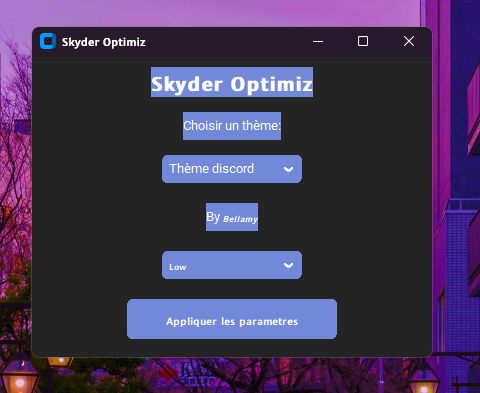
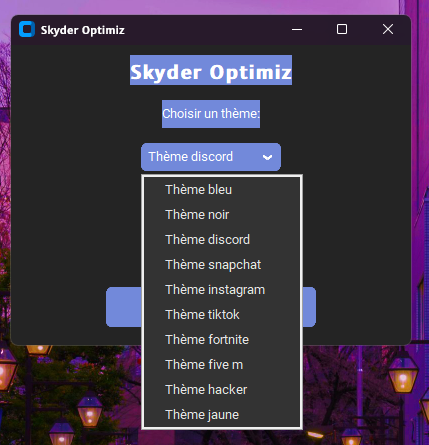

# 𝗦𝗸𝘆𝗱𝗲𝗿 𝗢𝗽𝘁𝗶𝗺𝗶𝘇

𝗦𝗸𝘆𝗱𝗲𝗿 𝗢𝗽𝘁𝗶𝗺𝗶𝘇 est une application Python utilisant la bibliothèque CustomTkinter pour créer une interface utilisateur moderne. Elle permet aux utilisateurs de choisir des thèmes et d'envoyer un message au webhook Discord.

## Fonctionnalités
- Choix de thèmes personnalisés.





- Interface utilisateur simple et intuitive.





- Optimiser son Fortnite.

## Prérequis

Avant de commencer, assurez-vous d'avoir installé les éléments suivants :
- Git
- Python 3.12
- Pip (gestionnaire de paquets Python)

## Installation

1. Clonez le dépôt sur votre machine locale :
   ```bash
   pip install customtkinter pillow requests
   ```
   ```bash
   git clone https://github.com/slider-dev/Optimiseur-Fortnite.git
## Lauch
- Clique droit sur Optimiz.py
- Executer avec python
